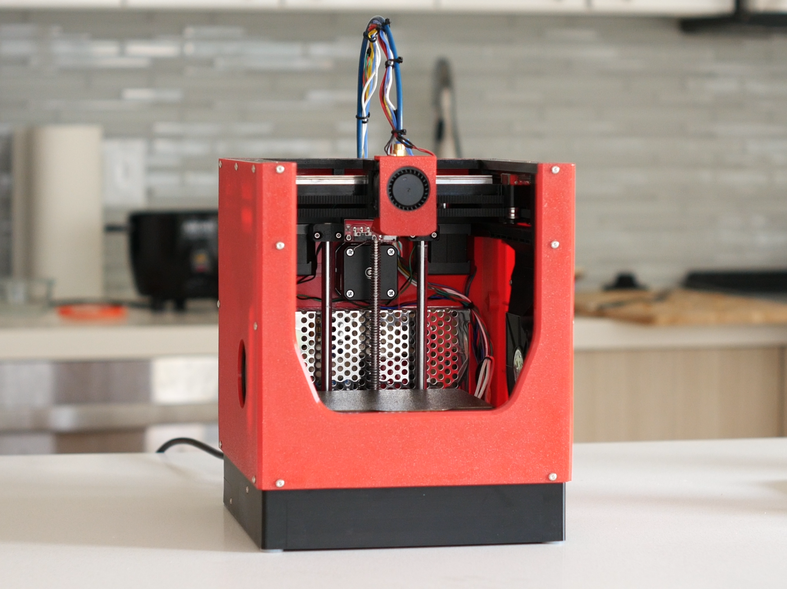

# encore
A mini CoreXY 3D printer with a 3D printed frame.

Build volume: ~120x120x120mm
Body dimensions (excl. Bowden parts): 219x221x262mm
Extrusion: Bambu-style hotend, Bowden extruder
Motion: MGN9C X/Y gantry, 8mm linear rod Z + 8mm leadscrew
Cooling: 4015 blower (print head) + dual 7515 blower (aux)

BOM and instructions currently WIP.

